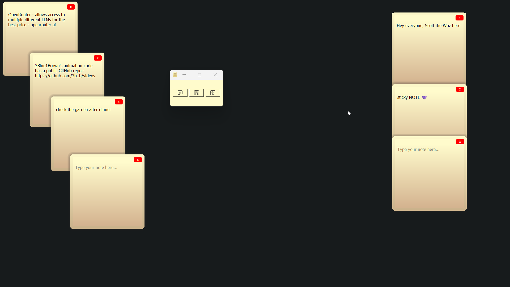

  

  <h3 align="center">Sticky</h3>

  

    Desktop sticky notes
  

## About

Use this program to place sticky notes around your screen to remind you of information for short-term use.
When I was a kid, I'd use similar programs to make my digital space familiar.