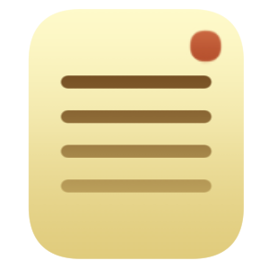

  

  <h3 align="center">Sticky</h3>

  

    Desktop sticky notes
  

## About

Put a bunch of these sticky notes around your screen to remind you of stuff for short-term use.
When I was a kid, I'd use similar programs to remind myself of stuff I need to do.